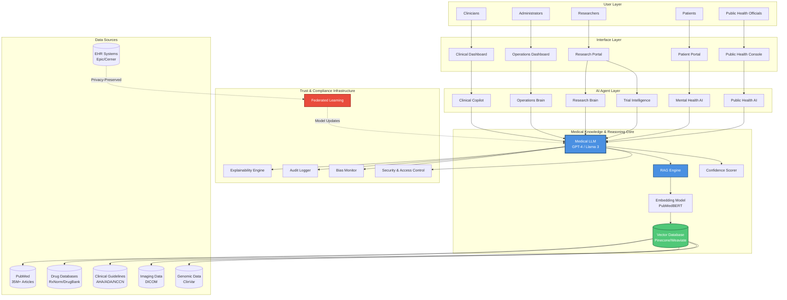
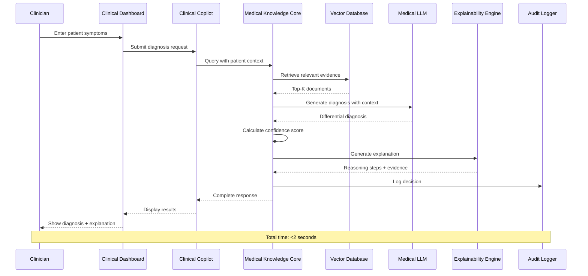
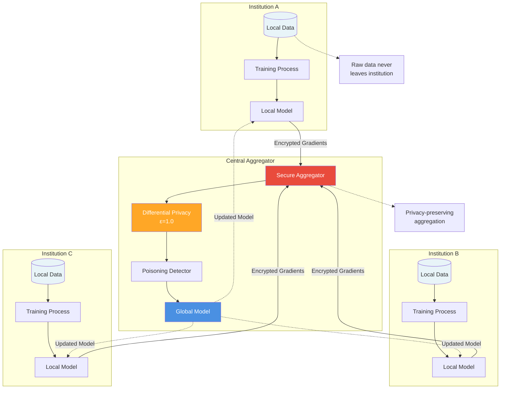
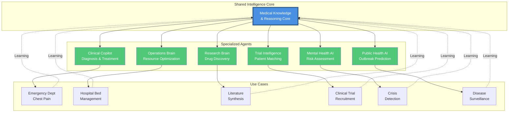
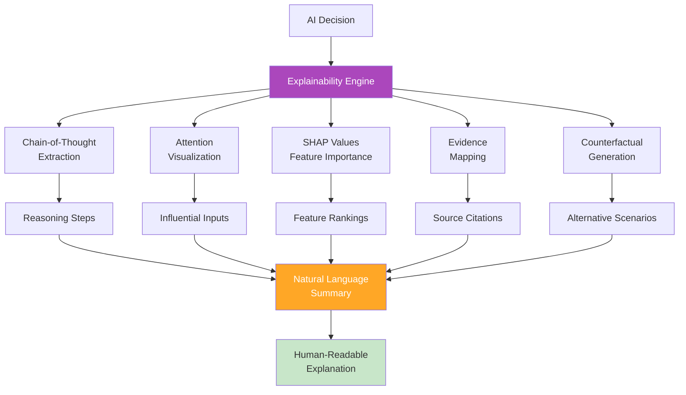
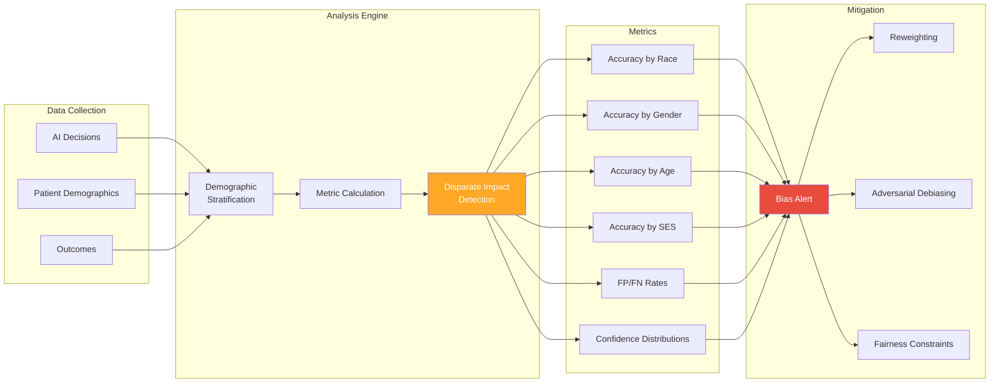
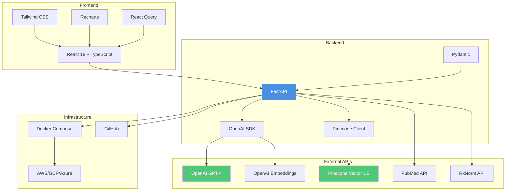
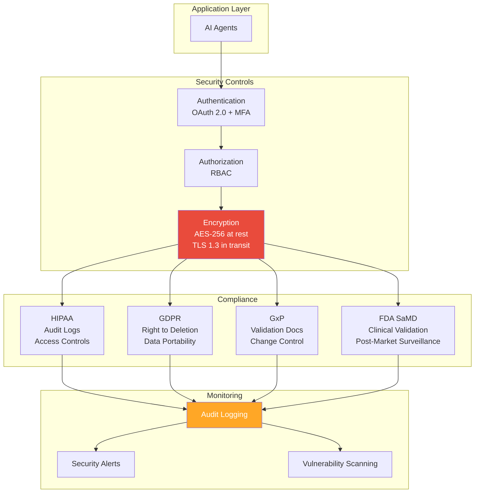
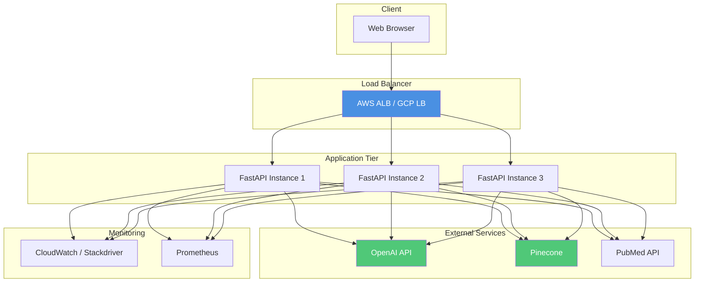

# UNIFIED AI HEALTH PLATFORM - ARCHITECTURE DIAGRAMS

This document contains Mermaid diagrams for the Unified AI Health Intelligence Platform architecture.

---

## 1. HIGH-LEVEL SYSTEM ARCHITECTURE

---

## 2. RAG PIPELINE DETAILED FLOW

```mermaid
graph LR
    A[User Query] --> B[Query Processing]
    B --> C[Entity Extraction]
    C --> D[Generate Embeddings]
    D --> E[Vector Search<br/>Top-K=10]
    E --> F[Cross-Encoder<br/>Reranking]
    F --> G[Context Assembly<br/>Top-5]
    G --> H[LLM Generation<br/>with Citations]
    H --> I[Confidence Scoring]
    I --> J[Explanation<br/>Generation]
    J --> K[Audit Logging]
    K --> L[Response to User]
    
    style A fill:#E8F4F8
    style L fill:#C8E6C9
    style H fill:#4A90E2,color:#fff
    style I fill:#FFA726,color:#fff
    style J fill:#AB47BC,color:#fff
```

---

## 3. CLINICAL COPILOT DATA FLOW

---

## 4. FEDERATED LEARNING ARCHITECTURE

---

## 5. MULTI-AGENT ECOSYSTEM

---

## 6. EXPLAINABILITY ENGINE ARCHITECTURE

---

## 7. BIAS MONITORING SYSTEM

---

## 8. MVP TECHNICAL STACK

---

## 9. SECURITY & COMPLIANCE LAYERS

---

## 10. DEPLOYMENT ARCHITECTURE (MVP)

---

## NOTES

These diagrams can be rendered using:
- Mermaid Live Editor: https://mermaid.live
- GitHub (native Mermaid support in markdown)
- VS Code with Mermaid extension
- Documentation tools (GitBook, Docusaurus, etc.)

For the hackathon presentation, consider:
1. Animating the RAG pipeline flow
2. Highlighting the unified core in the multi-agent diagram
3. Emphasizing privacy in the federated learning diagram
4. Using these in pitch deck slides

