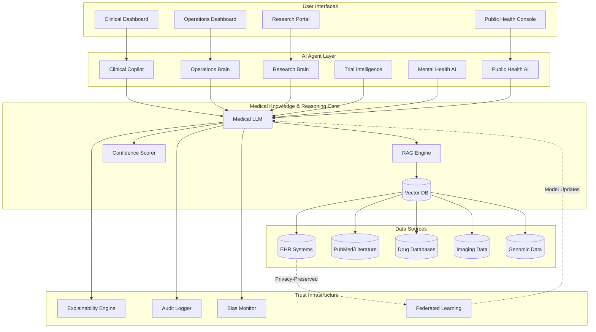

# Design Document: Unified AI Health Intelligence Platform

## Overview

The Unified AI Health Intelligence Platform represents a paradigm shift from fragmented healthcare AI tools to a coherent intelligence layer that serves the entire healthcare ecosystem. The core architectural insight is that medical reasoning should be unified and shared across use cases—a clinician diagnosing a patient, a hospital optimizing operations, and a researcher discovering drugs should all benefit from the same foundational medical knowledge, continuously improved through federated learning.

The platform consists of three architectural layers:

1. **Medical Knowledge & Reasoning Core**: A hybrid AI system combining large language models fine-tuned on medical literature, retrieval-augmented generation (RAG) over structured medical databases, and specialized models for imaging, genomics, and time-series analysis. This core provides consistent, explainable medical reasoning.

2. **Modular AI Agent Layer**: Six specialized agents (Clinical Copilot, Operations Brain, Research Brain, Trial Intelligence, Mental Health AI, Public Health AI) that leverage the shared core while implementing domain-specific logic and safety constraints.

3. **Trust & Compliance Infrastructure**: Cross-cutting concerns including explainability, federated learning, audit logging, bias monitoring, and regulatory compliance that ensure the platform is safe, fair, and legally deployable.

The MVP demonstration focuses on the Clinical Copilot agent powered by the Medical Knowledge Core with full explainability, demonstrating the unified intelligence concept in a 48-hour hackathon timeframe.

## Architecture

### System Architecture Diagram



### Technology Stack

**MVP (48-hour hackathon)**:
- **Frontend**: React with TypeScript, Tailwind CSS for rapid UI development
- **Backend**: Python FastAPI for API layer
- **Medical LLM**: OpenAI GPT-4 or Anthropic Claude with medical prompt engineering (production would use fine-tuned open-source models)
- **Vector Database**: Pinecone or Weaviate for medical knowledge embeddings
- **Data Sources**: Synthetic patient data, PubMed API, RxNorm drug database
- **Deployment**: Docker containers, deployed to cloud (AWS/GCP/Azure)

**Production Stack** (post-hackathon):
- **Medical LLM**: Fine-tuned Llama 3 70B or Med-PaLM 2 on medical corpora
- **Vector Database**: Weaviate with HNSW indexing for sub-100ms retrieval
- **Federated Learning**: PySyft or TensorFlow Federated
- **Compliance**: HashiCorp Vault for secrets, AWS KMS for encryption
- **Monitoring**: Prometheus + Grafana for metrics, custom bias dashboards
- **Infrastructure**: Kubernetes on HIPAA-compliant cloud (AWS GovCloud, Azure Healthcare)

## Components and Interfaces

### 1. Medical Knowledge & Reasoning Core

The core is implemented as a hybrid retrieval-augmented generation (RAG) system:

**Components**:
- **Medical LLM**: Base reasoning engine (GPT-4 for MVP, fine-tuned Llama 3 for production)
- **Embedding Model**: Specialized medical embeddings (PubMedBERT or BioBERT)
- **Vector Database**: Stores embeddings for clinical guidelines, research papers, drug interactions, disease ontologies
- **Confidence Scorer**: Ensemble model that estimates prediction uncertainty
- **Context Assembler**: Retrieves and ranks relevant medical knowledge for each query

**Interface**:
```python
class MedicalKnowledgeCore:
    def query(
        self,
        question: str,
        context: Dict[str, Any],
        agent_type: AgentType
    ) -> MedicalResponse:
        """
        Process a medical query with context.
        
        Args:
            question: Natural language medical question
            context: Structured context (patient data, operational metrics, etc.)
            agent_type: Which agent is making the request
            
        Returns:
            MedicalResponse with answer, confidence, evidence, and explanation
        """
        pass
    
    def get_evidence(
        self,
        query: str,
        top_k: int = 5
    ) -> List[EvidenceSource]:
        """Retrieve top-k relevant evidence sources."""
        pass
    
    def explain_reasoning(
        self,
        response_id: str
    ) -> Explanation:
        """Generate detailed explanation for a previous response."""
        pass

@dataclass
class MedicalResponse:
    answer: str
    confidence: float  # 0.0 to 1.0
    evidence_sources: List[EvidenceSource]
    reasoning_steps: List[str]
    response_id: str
    timestamp: datetime
    
@dataclass
class EvidenceSource:
    source_type: str  # "clinical_guideline", "research_paper", "drug_database"
    title: str
    citation: str
    relevance_score: float
    excerpt: str
```

**RAG Pipeline**:
1. **Query Processing**: Parse natural language query, extract medical entities (diseases, drugs, symptoms)
2. **Retrieval**: Query vector database for top-k relevant documents (k=10 for MVP)
3. **Reranking**: Use cross-encoder to rerank by relevance (top-5 for context)
4. **Context Assembly**: Format retrieved documents into LLM context window
5. **Generation**: LLM generates response with citations
6. **Confidence Scoring**: Ensemble of perplexity, semantic consistency, and evidence strength
7. **Explanation Generation**: Extract reasoning chain and evidence mapping

### 2. Clinical Copilot Agent

**Purpose**: Assist clinicians with diagnosis and treatment decisions in real-time.

**Components**:
- **Symptom Analyzer**: Processes patient symptoms and history
- **Differential Diagnosis Generator**: Produces ranked list of possible diagnoses
- **Treatment Recommender**: Suggests evidence-based interventions
- **Drug Interaction Checker**: Validates medication safety
- **Override Tracker**: Logs when clinicians override recommendations for learning

**Interface**:
```python
class ClinicalCopilot:
    def __init__(self, knowledge_core: MedicalKnowledgeCore):
        self.core = knowledge_core
        
    def generate_differential_diagnosis(
        self,
        symptoms: List[str],
        patient_history: PatientHistory,
        demographics: Demographics
    ) -> DifferentialDiagnosis:
        """Generate ranked differential diagnosis with evidence."""
        pass
    
    def recommend_treatment(
        self,
        diagnosis: str,
        patient_context: PatientContext
    ) -> TreatmentPlan:
        """Recommend evidence-based treatment with contraindication checks."""
        pass
    
    def check_drug_interactions(
        self,
        medications: List[str]
    ) -> InteractionReport:
        """Identify drug interactions and severity."""
        pass

@dataclass
class DifferentialDiagnosis:
    diagnoses: List[DiagnosisCandidate]
    confidence: float
    evidence: List[EvidenceSource]
    explanation: str
    
@dataclass
class DiagnosisCandidate:
    condition: str
    probability: float
    supporting_symptoms: List[str]
    distinguishing_features: str
```

**Data Flow**:
1. Clinician inputs patient symptoms via UI
2. Clinical Copilot structures data and queries Medical Knowledge Core
3. Core retrieves relevant clinical guidelines and case studies
4. LLM generates differential diagnosis with probabilities
5. Confidence scorer validates output
6. Explainability engine generates reasoning
7. Results displayed with interactive evidence exploration

### 3. Operations Brain Agent

**Purpose**: Optimize hospital operations through predictive analytics.

**Components**:
- **Bed Availability Predictor**: Time-series forecasting for census
- **Resource Optimizer**: Staffing and equipment allocation
- **Patient Flow Analyzer**: Bottleneck identification
- **Efficiency Scorer**: Operational metrics and benchmarking

**Interface**:
```python
class OperationsBrain:
    def predict_bed_availability(
        self,
        hospital_id: str,
        time_horizon_hours: int = 24
    ) -> BedForecast:
        """Predict bed availability with confidence intervals."""
        pass
    
    def optimize_staffing(
        self,
        current_census: int,
        predicted_admissions: int,
        shift_schedule: Schedule
    ) -> StaffingRecommendation:
        """Recommend staffing adjustments."""
        pass
    
    def analyze_patient_flow(
        self,
        department: str,
        time_range: TimeRange
    ) -> FlowAnalysis:
        """Identify bottlenecks and inefficiencies."""
        pass
```

**ML Techniques**:
- Time-series forecasting: LSTM or Transformer models for census prediction
- Optimization: Linear programming for resource allocation
- Anomaly detection: Isolation forests for unusual patterns

### 4. Research Brain Agent

**Purpose**: Accelerate drug discovery and research insights.

**Components**:
- **Literature Synthesizer**: Automated systematic reviews
- **Drug-Target Predictor**: Molecular interaction modeling
- **Experiment Suggester**: Hypothesis generation from data patterns
- **Citation Network Analyzer**: Research trend identification

**Interface**:
```python
class ResearchBrain:
    def synthesize_literature(
        self,
        research_question: str,
        date_range: Optional[DateRange] = None
    ) -> LiteratureSynthesis:
        """Generate comprehensive literature review with citations."""
        pass
    
    def predict_drug_targets(
        self,
        compound_structure: str,
        disease: str
    ) -> List[DrugTargetPrediction]:
        """Identify potential drug-target interactions."""
        pass
    
    def suggest_experiments(
        self,
        hypothesis: str,
        available_data: DataSummary
    ) -> List[ExperimentSuggestion]:
        """Recommend follow-up experiments."""
        pass
```

### 5. Trial Intelligence Agent

**Purpose**: Optimize clinical trial design and patient recruitment.

**Components**:
- **Patient Matcher**: EHR-based eligibility screening
- **Protocol Optimizer**: Trial design feasibility analysis
- **Enrollment Predictor**: Recruitment timeline forecasting
- **Safety Monitor**: Early signal detection

**Interface**:
```python
class TrialIntelligence:
    def match_patients(
        self,
        inclusion_criteria: List[Criterion],
        exclusion_criteria: List[Criterion],
        ehr_system: EHRConnector
    ) -> List[PatientMatch]:
        """Identify eligible patients with privacy preservation."""
        pass
    
    def optimize_protocol(
        self,
        trial_design: TrialProtocol
    ) -> ProtocolOptimization:
        """Analyze feasibility and suggest improvements."""
        pass
    
    def predict_enrollment(
        self,
        trial_id: str,
        current_enrollment: int
    ) -> EnrollmentForecast:
        """Forecast enrollment timeline."""
        pass
```

### 6. Mental Health AI Agent

**Purpose**: Support mental health assessment and intervention.

**Components**:
- **Risk Assessor**: Depression, anxiety, crisis screening
- **Intervention Recommender**: Evidence-based coping strategies
- **Sentiment Analyzer**: Text and voice pattern analysis
- **Crisis Detector**: Real-time high-risk identification

**Interface**:
```python
class MentalHealthAI:
    def assess_risk(
        self,
        patient_responses: Dict[str, Any],
        historical_data: Optional[MentalHealthHistory] = None
    ) -> RiskAssessment:
        """Assess mental health risk levels."""
        pass
    
    def recommend_interventions(
        self,
        assessment: RiskAssessment,
        patient_preferences: PatientPreferences
    ) -> List[Intervention]:
        """Suggest personalized interventions."""
        pass
    
    def detect_crisis(
        self,
        text_input: str,
        voice_features: Optional[VoiceFeatures] = None
    ) -> CrisisAlert:
        """Detect immediate crisis indicators."""
        pass
```

### 7. Public Health AI Agent

**Purpose**: Predict and monitor population health trends.

**Components**:
- **Outbreak Predictor**: Epidemiological forecasting
- **Anomaly Detector**: Unusual health pattern identification
- **Intervention Simulator**: Policy scenario modeling
- **Social Determinants Analyzer**: Health equity insights

**Interface**:
```python
class PublicHealthAI:
    def predict_outbreak(
        self,
        disease: str,
        geographic_region: str,
        time_horizon_days: int = 30
    ) -> OutbreakForecast:
        """Predict disease outbreak probability."""
        pass
    
    def detect_anomalies(
        self,
        surveillance_data: SurveillanceData
    ) -> List[HealthAnomaly]:
        """Identify unusual health patterns."""
        pass
    
    def simulate_intervention(
        self,
        policy: HealthPolicy,
        population: PopulationModel
    ) -> InterventionSimulation:
        """Model expected outcomes of health interventions."""
        pass
```

### 8. Explainability Engine

**Purpose**: Generate human-readable explanations for all AI decisions.

**Techniques**:
- **Attention Visualization**: Highlight influential input tokens
- **SHAP Values**: Feature importance for structured data
- **Chain-of-Thought**: Step-by-step reasoning extraction
- **Evidence Mapping**: Link conclusions to source documents
- **Counterfactual Explanations**: "What would change the decision?"

**Interface**:
```python
class ExplainabilityEngine:
    def explain_decision(
        self,
        response_id: str,
        detail_level: str = "standard"  # "brief", "standard", "detailed"
    ) -> Explanation:
        """Generate explanation for an AI decision."""
        pass
    
    def highlight_influential_factors(
        self,
        response_id: str
    ) -> List[InfluentialFactor]:
        """Identify which inputs most affected the decision."""
        pass
    
    def generate_counterfactuals(
        self,
        response_id: str,
        num_examples: int = 3
    ) -> List[Counterfactual]:
        """Show what would change the decision."""
        pass

@dataclass
class Explanation:
    summary: str
    reasoning_steps: List[ReasoningStep]
    evidence_sources: List[EvidenceSource]
    influential_factors: List[InfluentialFactor]
    confidence_breakdown: Dict[str, float]
    
@dataclass
class ReasoningStep:
    step_number: int
    description: str
    evidence_used: List[str]
    confidence_impact: float
```

**Implementation**:
- Use LLM's chain-of-thought prompting to extract reasoning
- Store attention weights during inference
- Apply LIME/SHAP for structured data inputs
- Generate natural language summaries of technical explanations

### 9. Federated Learning Infrastructure

**Purpose**: Enable collaborative learning across institutions without sharing raw data.

**Architecture**:
```
Institution A     Institution B     Institution C
    |                 |                 |
    | Local Model     | Local Model     | Local Model
    | Training        | Training        | Training
    |                 |                 |
    +--------+--------+--------+--------+
             |
        Central Aggregator
             |
    (Differential Privacy)
             |
        Global Model
             |
    Distributed to All
```

**Components**:
- **Local Training Coordinator**: Manages training at each institution
- **Secure Aggregator**: Combines model updates with privacy preservation
- **Differential Privacy Module**: Adds calibrated noise to gradients
- **Poisoning Detector**: Identifies malicious or biased updates
- **Model Distributor**: Deploys improved models to participants

**Interface**:
```python
class FederatedLearningLayer:
    def initiate_training_round(
        self,
        model_version: str,
        participants: List[str]
    ) -> TrainingRound:
        """Start a new federated training round."""
        pass
    
    def submit_local_update(
        self,
        institution_id: str,
        model_update: ModelUpdate,
        training_metrics: TrainingMetrics
    ) -> UpdateStatus:
        """Submit local model update for aggregation."""
        pass
    
    def aggregate_updates(
        self,
        round_id: str,
        privacy_budget: float
    ) -> AggregatedModel:
        """Combine updates with differential privacy."""
        pass
    
    def detect_poisoning(
        self,
        updates: List[ModelUpdate]
    ) -> List[PoisoningAlert]:
        """Identify suspicious model updates."""
        pass
```

**Privacy Guarantees**:
- Differential privacy with ε = 1.0 (configurable)
- Secure multi-party computation for aggregation
- Homomorphic encryption for sensitive gradients (optional)
- No raw data leaves institutional boundaries

### 10. Audit Logging System

**Purpose**: Maintain immutable record of all AI decisions and data access.

**Schema**:
```python
@dataclass
class AuditLogEntry:
    log_id: str
    timestamp: datetime
    user_id: str
    user_role: str
    agent_type: AgentType
    action: str  # "query", "recommendation", "data_access", "override"
    input_summary: str  # Anonymized
    output_summary: str  # Anonymized
    confidence_score: float
    evidence_sources: List[str]
    patient_id_hash: Optional[str]  # One-way hash for privacy
    session_id: str
    ip_address_hash: str
    compliance_flags: List[str]  # HIPAA, GDPR markers
```

**Storage**: Append-only database (e.g., Amazon QLDB or PostgreSQL with triggers)

**Retention**: 7 years for HIPAA compliance, with automated anonymization after 2 years

### 11. Bias Monitoring System

**Purpose**: Continuously monitor for demographic bias in AI decisions.

**Metrics Tracked**:
- **Diagnostic Accuracy by Demographics**: Precision, recall, F1 across race, gender, age, SES
- **Treatment Recommendation Parity**: Consistency of recommendations for similar cases
- **False Positive/Negative Rates**: Disparate impact analysis
- **Confidence Score Distribution**: Check for systematic under/over-confidence

**Interface**:
```python
class BiasMonitor:
    def analyze_outcomes(
        self,
        time_range: TimeRange,
        demographic_groups: List[str]
    ) -> BiasReport:
        """Analyze outcomes across demographic groups."""
        pass
    
    def detect_disparate_impact(
        self,
        agent_type: AgentType,
        outcome_metric: str
    ) -> List[BiasAlert]:
        """Identify statistical bias in recommendations."""
        pass
    
    def recommend_mitigations(
        self,
        bias_alert: BiasAlert
    ) -> List[MitigationStrategy]:
        """Suggest corrective actions."""
        pass

@dataclass
class BiasReport:
    overall_fairness_score: float  # 0-100
    demographic_breakdowns: Dict[str, MetricsByGroup]
    detected_biases: List[BiasAlert]
    trend_analysis: TrendData
    recommended_actions: List[str]
```

**Mitigation Strategies**:
- Reweighting training data
- Adversarial debiasing
- Fairness constraints in optimization
- Demographic-specific confidence thresholds

## Data Models

### Core Data Structures

```python
@dataclass
class PatientContext:
    patient_id: str
    demographics: Demographics
    medical_history: MedicalHistory
    current_medications: List[Medication]
    allergies: List[str]
    vital_signs: VitalSigns
    lab_results: List[LabResult]
    
@dataclass
class Demographics:
    age: int
    gender: str
    race: Optional[str]
    ethnicity: Optional[str]
    socioeconomic_status: Optional[str]
    
@dataclass
class MedicalHistory:
    conditions: List[Condition]
    procedures: List[Procedure]
    family_history: List[FamilyCondition]
    social_history: SocialHistory
    
@dataclass
class Condition:
    icd10_code: str
    name: str
    onset_date: date
    status: str  # "active", "resolved", "chronic"
    severity: Optional[str]
    
@dataclass
class Medication:
    name: str
    rxnorm_code: str
    dosage: str
    frequency: str
    start_date: date
    end_date: Optional[date]
    
@dataclass
class VitalSigns:
    temperature: float
    blood_pressure_systolic: int
    blood_pressure_diastolic: int
    heart_rate: int
    respiratory_rate: int
    oxygen_saturation: float
    timestamp: datetime
```

### Knowledge Base Schema

```python
@dataclass
class ClinicalGuideline:
    guideline_id: str
    title: str
    organization: str  # "AHA", "ADA", "NCCN", etc.
    publication_date: date
    condition: str
    recommendations: List[Recommendation]
    evidence_level: str  # "A", "B", "C"
    embedding: List[float]  # Vector representation
    
@dataclass
class ResearchPaper:
    pubmed_id: str
    title: str
    authors: List[str]
    journal: str
    publication_date: date
    abstract: str
    full_text: Optional[str]
    citations: int
    study_type: str  # "RCT", "cohort", "case-control", etc.
    embedding: List[float]
    
@dataclass
class DrugInteraction:
    drug_a: str
    drug_b: str
    interaction_type: str  # "major", "moderate", "minor"
    mechanism: str
    clinical_effect: str
    management: str
    evidence_level: str
```

### API Request/Response Models

```python
@dataclass
class DiagnosisRequest:
    patient_context: PatientContext
    chief_complaint: str
    symptoms: List[Symptom]
    duration: str
    severity: int  # 1-10 scale
    
@dataclass
class Symptom:
    name: str
    snomed_code: Optional[str]
    onset: str
    characteristics: Dict[str, Any]
    
@dataclass
class DiagnosisResponse:
    response_id: str
    differential_diagnoses: List[DiagnosisCandidate]
    recommended_tests: List[DiagnosticTest]
    red_flags: List[str]
    confidence: float
    explanation: Explanation
    evidence_sources: List[EvidenceSource]
    timestamp: datetime
```

## MVP Implementation Plan (48-Hour Hackathon)

### Scope Definition

**In Scope**:
- Medical Knowledge Core with RAG (using OpenAI API + Pinecone)
- Clinical Copilot agent (diagnosis and treatment recommendations)
- Explainability Engine (basic chain-of-thought)
- Web UI for clinical scenario demonstration
- Synthetic patient data (3-5 realistic cases)
- Integration with PubMed API and RxNorm

**Out of Scope** (post-hackathon):
- Other 5 agents (Operations, Research, Trial, Mental Health, Public Health)
- Federated learning infrastructure
- Full HIPAA compliance implementation
- Bias monitoring dashboards
- Production-grade security
- Real EHR integration

### Technical Architecture (MVP)

```
Frontend (React)
    ↓
FastAPI Backend
    ↓
Medical Knowledge Core
    ├── OpenAI GPT-4 API
    ├── Pinecone Vector DB
    ├── PubMed API
    └── RxNorm API
```

### Hour-by-Hour Plan

**Hours 0-8: Foundation**
- Set up project structure (FastAPI + React)
- Configure OpenAI and Pinecone APIs
- Create synthetic patient dataset (5 cases)
- Implement basic Medical Knowledge Core interface
- Index medical knowledge in Pinecone (clinical guidelines, sample papers)

**Hours 8-16: Core Functionality**
- Implement RAG pipeline (query → retrieve → generate)
- Build Clinical Copilot diagnosis logic
- Implement confidence scoring (basic perplexity-based)
- Create explainability module (extract reasoning from LLM)
- Integrate PubMed API for evidence retrieval

**Hours 16-24: UI Development**
- Build clinical dashboard UI
- Create patient input form
- Design diagnosis display with evidence
- Implement interactive explanation viewer
- Add confidence visualization

**Hours 24-32: Polish & Demo Prep**
- Refine prompts for better medical accuracy
- Add drug interaction checking (RxNorm)
- Improve explanation quality
- Create demo script and scenarios
- Test end-to-end workflows

**Hours 32-40: Testing & Refinement**
- Test with all 5 patient scenarios
- Fix bugs and edge cases
- Optimize response times
- Prepare presentation slides
- Record demo video backup

**Hours 40-48: Presentation**
- Final rehearsal
- Prepare for Q&A
- Deploy to cloud for live demo
- Create pitch deck
- Present to judges

### Demo Scenario

**Patient Case**: 45-year-old male with chest pain

**Demo Flow**:
1. **Input**: Clinician enters symptoms (chest pain, shortness of breath, sweating)
2. **Processing**: Show real-time RAG retrieval (visualize knowledge sources being queried)
3. **Diagnosis**: Display differential diagnosis:
   - Acute Coronary Syndrome (78% probability)
   - Pulmonary Embolism (12% probability)
   - GERD (7% probability)
   - Panic Attack (3% probability)
4. **Explanation**: Interactive explanation showing:
   - Reasoning steps
   - Evidence from clinical guidelines (AHA chest pain guidelines)
   - Risk factors identified (age, male, symptoms)
   - Why other diagnoses less likely
5. **Treatment**: Recommend immediate ECG, troponin, aspirin administration
6. **Drug Check**: Verify no contraindications with patient's medications
7. **Confidence**: Show 0.78 confidence score with uncertainty breakdown

**"Wow" Factor Elements**:
- Real-time evidence retrieval visualization
- Interactive explanation with clickable citations
- Confidence score that updates as more information added
- Side-by-side comparison of "with AI" vs "without AI" decision quality
- Show how the same Medical Knowledge Core could power other agents (conceptual)

### UI Mockup Description

**Main Dashboard**:
- Left panel: Patient information input
- Center panel: AI recommendations with confidence bars
- Right panel: Evidence sources and explanations
- Bottom: Interactive reasoning chain visualization

**Key UI Features**:
- Color-coded confidence levels (green >0.7, yellow 0.4-0.7, red <0.4)
- Expandable evidence cards with citations
- Hover tooltips for medical terms
- "Explain this" button for any recommendation
- Override tracking with reason input


## Correctness Properties

A property is a characteristic or behavior that should hold true across all valid executions of a system—essentially, a formal statement about what the system should do. Properties serve as the bridge between human-readable specifications and machine-verifiable correctness guarantees.

### Property Reflection

After analyzing all acceptance criteria, several patterns of redundancy emerged:

1. **Confidence Score Properties**: Multiple requirements (1.2, 2.4, 8.1) specify confidence scores. These can be consolidated into a single property about confidence score validity.

2. **Explanation Properties**: Requirements 1.3, 8.2, 8.3, 8.5 all relate to explanation completeness. These can be combined into comprehensive explanation properties.

3. **Logging Properties**: Requirements 1.4, 2.5, 10.3 all specify audit logging. These can be unified into logging completeness properties.

4. **Privacy Properties**: Requirements 5.1, 9.1, 9.2 all relate to data privacy. These can be consolidated into privacy preservation properties.

5. **Alert Generation**: Requirements 2.3, 6.2, 7.2, 11.2 all specify alert generation patterns. These share common structure.

The following properties represent the unique, non-redundant correctness guarantees after consolidation.

### Core Medical Knowledge Properties

**Property 1: Retrieval Relevance**
*For any* clinical query submitted to the Medical_Knowledge_Core, all retrieved documents should have relevance scores above a minimum threshold (0.3) and should contain at least one medical entity from the query.
**Validates: Requirements 1.1**

**Property 2: Confidence Score Validity**
*For any* recommendation generated by any AI agent, the Confidence_Score must be a valid float between 0.0 and 1.0 inclusive.
**Validates: Requirements 1.2, 2.4**

**Property 3: Explanation Completeness**
*For any* recommendation generated by any AI agent, the explanation must include at least one evidence source citation, at least one reasoning step, and identification of influential input features.
**Validates: Requirements 1.3, 8.2, 8.3, 8.5**

**Property 4: Audit Log Completeness**
*For any* request processed by the Platform, the Audit_Log must contain an entry with all required fields: timestamp, user_id, action, input_summary, output_summary, confidence_score, and session_id.
**Validates: Requirements 1.4, 2.5, 10.3**

**Property 5: Explanation Performance**
*For any* recommendation, when a user requests an explanation, the Explainability_Engine must return a response within 2 seconds.
**Validates: Requirements 8.1**

### Clinical Copilot Properties

**Property 6: Differential Diagnosis Structure**
*For any* valid patient symptom input, the Clinical_Copilot must return a list of at least one diagnosis candidate, each with a probability value between 0 and 1, and the sum of all probabilities should not exceed 1.0.
**Validates: Requirements 2.1**

**Property 7: Contraindication Checking**
*For any* treatment recommendation request, the Clinical_Copilot must check for contraindications against the patient's current medications, allergies, and conditions, and include any warnings in the response.
**Validates: Requirements 2.2**

**Property 8: Drug Interaction Detection**
*For any* pair of medications known to interact (from the drug interaction database), when both are present in a patient's medication list, the Platform must generate an alert with severity level and alternative suggestions.
**Validates: Requirements 2.3**

### Operations Brain Properties

**Property 9: Prediction Confidence Intervals**
*For any* bed availability prediction, the Operations_Brain must provide confidence intervals (lower and upper bounds) in addition to the point estimate.
**Validates: Requirements 3.1**

**Property 10: Optimization Simulation**
*For any* optimization recommendation generated by the Operations_Brain, the response must include simulated expected outcomes with uncertainty ranges.
**Validates: Requirements 3.5**

### Research Brain Properties

**Property 11: Research Output Citation**
*For any* literature synthesis or drug-target query, the Research_Brain must include at least one citation link to supporting literature.
**Validates: Requirements 4.1, 4.3**

**Property 12: Insight Evidence**
*For any* novel insight identified by the Research_Brain, the response must include supporting evidence sources and a confidence level.
**Validates: Requirements 4.5**

### Trial Intelligence Properties

**Property 13: Privacy-Preserving Matching**
*For any* patient matching operation, the Trial_Intelligence must not expose raw patient data in the response—only anonymized match scores and eligibility rationale.
**Validates: Requirements 5.1**

**Property 14: Match Ranking**
*For any* set of patient matches, candidates must be ranked in descending order by eligibility confidence score, and each match must include a rationale.
**Validates: Requirements 5.5**

**Property 15: Signal Detection Confidence**
*For any* efficacy or safety signal detected in trial monitoring, the Trial_Intelligence must provide statistical confidence (p-value or confidence interval).
**Validates: Requirements 5.3**

### Mental Health AI Properties

**Property 16: Risk Assessment Completeness**
*For any* patient self-report data, the Mental_Health_AI must generate risk scores for depression, anxiety, and crisis, each with a numerical value and risk level classification (low/medium/high).
**Validates: Requirements 6.1**

**Property 17: High-Risk Alerting**
*For any* risk assessment where any risk score exceeds the high-risk threshold, the Platform must generate an immediate alert to providers with recommended interventions.
**Validates: Requirements 6.2**

**Property 18: Assessment Explainability**
*For any* mental health risk assessment, the explanation must identify which factors (symptoms, responses, behavioral patterns) contributed most to the risk score.
**Validates: Requirements 6.5**

### Public Health AI Properties

**Property 19: Outbreak Prediction Granularity**
*For any* outbreak prediction, the response must include geographic granularity (at least county-level) and time-series predictions for the specified time horizon.
**Validates: Requirements 7.1**

**Property 20: Anomaly Severity**
*For any* detected health anomaly, the Platform must include a severity assessment (low/medium/high/critical) in the alert.
**Validates: Requirements 7.2**

**Property 21: Intervention Simulation**
*For any* policy intervention query, the Public_Health_AI must generate scenario analysis with expected outcomes and uncertainty quantification.
**Validates: Requirements 7.3, 7.5**

### Federated Learning Properties

**Property 22: Data Locality**
*For any* federated learning training round, raw patient data must never be transmitted outside the originating institution's infrastructure—only model updates (gradients or weights) should be shared.
**Validates: Requirements 9.1**

**Property 23: Differential Privacy Application**
*For any* model update aggregation, the Federated_Learning_Layer must apply differential privacy with the configured epsilon value, and the privacy budget must be tracked and enforced.
**Validates: Requirements 9.2**

**Property 24: Poisoning Detection**
*For any* submitted model update that deviates from expected statistical properties (e.g., gradient norms exceeding 3 standard deviations from the mean), the Platform must flag and reject the update.
**Validates: Requirements 9.3**

**Property 25: Model Distribution**
*For any* completed federated learning round, all participating institutions must receive the updated global model within 5 minutes of aggregation completion.
**Validates: Requirements 9.4**

### Bias Monitoring Properties

**Property 26: Demographic Outcome Analysis**
*For any* set of recommendations over a time period, the Platform must be able to compute and compare outcome metrics (accuracy, precision, recall) across all demographic groups (race, gender, age, SES).
**Validates: Requirements 11.1**

**Property 27: Bias Alert Generation**
*For any* detected statistical bias where the performance difference between demographic groups exceeds the fairness threshold (e.g., 10% difference in accuracy), the Platform must generate an alert with bias metrics and affected populations.
**Validates: Requirements 11.2**

**Property 28: Mitigation Documentation**
*For any* training dataset with demographic imbalance (any group representing <5% of data), the Platform must apply at least one bias mitigation technique and log the approach used.
**Validates: Requirements 11.4**

### Human Oversight Properties

**Property 29: High-Stakes Approval**
*For any* recommendation classified as high-stakes (confidence < 0.6 or involving critical interventions), the Platform must require human approval before execution and must not proceed without it.
**Validates: Requirements 12.1**

**Property 30: Low-Confidence Escalation**
*For any* recommendation with Confidence_Score below the configured threshold, the Platform must add the decision to the human review queue with appropriate priority.
**Validates: Requirements 12.2**

**Property 31: Override Pattern Detection**
*For any* specific scenario type where clinicians override AI recommendations more than 50% of the time over a 30-day period, the Platform must flag this pattern for model review.
**Validates: Requirements 12.4**

### API and Integration Properties

**Property 32: API Authentication**
*For any* API request without valid OAuth 2.0 JWT token, the Platform must reject the request with HTTP 401 Unauthorized.
**Validates: Requirements 14.3**

**Property 33: Rate Limit Response**
*For any* API request that exceeds the configured rate limit, the Platform must return HTTP 429 with a Retry-After header indicating when the client can retry.
**Validates: Requirements 14.5**

### Performance Properties

**Property 34: Query Response Time**
*For any* batch of 100 queries to the Medical_Knowledge_Core, at least 95 queries must receive responses within 2 seconds.
**Validates: Requirements 15.1**

**Property 35: Concurrent User Support**
*For any* load test with 1000 concurrent users making queries, the median response time must not exceed 3 seconds and the error rate must remain below 1%.
**Validates: Requirements 15.2**

**Property 36: Batch Processing Performance**
*For any* batch analytics job processing 1 million patient records, the job must complete within 1 hour.
**Validates: Requirements 15.4**

### MVP Demonstration Properties

**Property 37: Demo Workflow Performance**
*For any* demonstration workflow (patient input → diagnosis → treatment → explanation), the total end-to-end execution time must be less than 3 minutes.
**Validates: Requirements 13.4**

## Error Handling

### Error Categories

The platform must handle four categories of errors:

1. **Input Validation Errors**: Invalid patient data, malformed queries, missing required fields
2. **External Service Errors**: API failures (OpenAI, Pinecone, PubMed), network timeouts, rate limits
3. **Internal Processing Errors**: Model inference failures, database errors, insufficient confidence
4. **Security Errors**: Authentication failures, authorization violations, data access violations

### Error Handling Strategy

**Input Validation**:
```python
class ValidationError(Exception):
    def __init__(self, field: str, message: str, error_code: str):
        self.field = field
        self.message = message
        self.error_code = error_code
        
# Example usage
if not symptoms:
    raise ValidationError(
        field="symptoms",
        message="At least one symptom is required",
        error_code="MISSING_SYMPTOMS"
    )
```

**External Service Failures**:
- Implement exponential backoff retry (3 attempts with 1s, 2s, 4s delays)
- Circuit breaker pattern: After 5 consecutive failures, open circuit for 60 seconds
- Fallback to cached responses when available
- Return degraded service response with explanation

**Insufficient Confidence**:
- When confidence < 0.4: Return response with prominent warning and escalate to human review
- When confidence < 0.2: Refuse to provide recommendation, explain limitations
- Always provide confidence score and uncertainty explanation

**Security Errors**:
- Log all security violations to audit log with full context
- Return generic error messages to users (avoid information leakage)
- Alert security team for repeated violations
- Implement rate limiting on authentication attempts

### Error Response Format

```python
@dataclass
class ErrorResponse:
    error_code: str
    message: str
    details: Optional[Dict[str, Any]]
    timestamp: datetime
    request_id: str
    suggested_action: Optional[str]
    
# Example
ErrorResponse(
    error_code="LOW_CONFIDENCE",
    message="Unable to provide diagnosis with sufficient confidence",
    details={
        "confidence": 0.18,
        "reason": "Insufficient symptom information",
        "missing_data": ["vital_signs", "lab_results"]
    },
    timestamp=datetime.now(),
    request_id="req_abc123",
    suggested_action="Please provide additional patient information"
)
```

### Graceful Degradation

When components fail, the platform should degrade gracefully:

- **Vector DB unavailable**: Fall back to keyword search or cached results
- **LLM API failure**: Use simpler rule-based logic for critical functions
- **Explainability Engine failure**: Provide basic explanation without detailed reasoning
- **Audit Log failure**: Queue logs locally and retry, but don't block user requests

## Testing Strategy

### Dual Testing Approach

The platform requires both unit testing and property-based testing for comprehensive coverage:

**Unit Tests**: Focus on specific examples, edge cases, and integration points
- Specific patient scenarios with known diagnoses
- Edge cases: empty inputs, extreme values, boundary conditions
- Error conditions: API failures, timeouts, invalid data
- Integration: Component interactions, API contracts

**Property-Based Tests**: Verify universal properties across all inputs
- Generate random patient data and verify output structure
- Test confidence score validity across thousands of inputs
- Verify audit logging for all request types
- Validate privacy preservation with various data patterns

### Property-Based Testing Configuration

**Framework**: Hypothesis (Python) for property-based testing

**Configuration**:
- Minimum 100 iterations per property test (due to randomization)
- Seed for reproducibility: Use fixed seed in CI/CD
- Shrinking enabled: Automatically find minimal failing examples
- Deadline: 10 seconds per test case

**Test Tagging**:
Each property test must reference its design document property:
```python
@given(patient_data=patient_strategy())
@settings(max_examples=100)
def test_confidence_score_validity(patient_data):
    """
    Feature: unified-ai-health-platform, Property 2: Confidence Score Validity
    
    For any recommendation generated by any AI agent, the Confidence_Score 
    must be a valid float between 0.0 and 1.0 inclusive.
    """
    response = clinical_copilot.generate_differential_diagnosis(patient_data)
    assert 0.0 <= response.confidence <= 1.0
    assert isinstance(response.confidence, float)
```

### Test Data Strategies

**Hypothesis Strategies for Medical Data**:
```python
from hypothesis import strategies as st

# Generate realistic patient ages
age_strategy = st.integers(min_value=0, max_value=120)

# Generate symptom lists
symptom_strategy = st.lists(
    st.sampled_from([
        "chest pain", "shortness of breath", "fever", 
        "cough", "headache", "fatigue", "nausea"
    ]),
    min_size=1,
    max_size=10
)

# Generate patient data
@st.composite
def patient_strategy(draw):
    return PatientContext(
        patient_id=draw(st.uuids()),
        demographics=Demographics(
            age=draw(age_strategy),
            gender=draw(st.sampled_from(["M", "F", "Other"])),
            race=draw(st.sampled_from(["White", "Black", "Asian", "Hispanic", "Other"]))
        ),
        symptoms=draw(symptom_strategy),
        medications=draw(st.lists(st.text(min_size=3, max_size=20), max_size=10))
    )
```

### Unit Test Coverage Goals

- **Core Components**: 90% code coverage
- **API Endpoints**: 100% coverage (all success and error paths)
- **Critical Safety Logic**: 100% coverage (drug interactions, contraindications)
- **UI Components**: 80% coverage (focus on user interactions)

### Integration Testing

**End-to-End Scenarios**:
1. Complete clinical workflow: Patient input → Diagnosis → Treatment → Explanation
2. Multi-agent coordination: Clinical Copilot + Operations Brain sharing knowledge
3. Federated learning round: Local training → Aggregation → Distribution
4. Error recovery: API failure → Fallback → Recovery

**Performance Testing**:
- Load testing: 1000 concurrent users for 10 minutes
- Stress testing: Gradually increase load until failure
- Latency testing: Measure p50, p95, p99 response times
- Batch processing: 1M record analytics job

### MVP Testing Scope

For the 48-hour hackathon MVP, focus on:
- Unit tests for core Medical Knowledge Core functions
- Property tests for Properties 2, 3, 4, 6, 8 (most critical)
- Integration test for the demo scenario
- Manual testing of UI workflows
- Performance testing: Single user response time

Post-hackathon, expand to full property test suite and comprehensive integration testing.

## Deployment Architecture

### MVP Deployment (Hackathon)

**Infrastructure**:
- Single cloud VM (AWS EC2 t3.large or equivalent)
- Docker Compose for service orchestration
- Nginx reverse proxy
- Let's Encrypt SSL certificate

**Services**:
```yaml
version: '3.8'
services:
  frontend:
    image: unified-health-frontend:latest
    ports:
      - "3000:3000"
    environment:
      - REACT_APP_API_URL=https://api.unified-health.demo
      
  backend:
    image: unified-health-backend:latest
    ports:
      - "8000:8000"
    environment:
      - OPENAI_API_KEY=${OPENAI_API_KEY}
      - PINECONE_API_KEY=${PINECONE_API_KEY}
      - DATABASE_URL=postgresql://user:pass@db:5432/unified_health
    depends_on:
      - db
      
  db:
    image: postgres:15
    volumes:
      - postgres_data:/var/lib/postgresql/data
    environment:
      - POSTGRES_PASSWORD=${DB_PASSWORD}
      
  nginx:
    image: nginx:alpine
    ports:
      - "80:80"
      - "443:443"
    volumes:
      - ./nginx.conf:/etc/nginx/nginx.conf
      - ./ssl:/etc/nginx/ssl
    depends_on:
      - frontend
      - backend
```

### Production Deployment (Post-Hackathon)

**Infrastructure**:
- Kubernetes cluster (EKS, GKE, or AKS)
- Multi-region deployment for high availability
- Auto-scaling based on CPU/memory and custom metrics
- CDN for frontend assets (CloudFront, CloudFlare)

**Security**:
- HIPAA-compliant cloud environment (AWS GovCloud, Azure Healthcare)
- Encryption at rest: AWS KMS, Azure Key Vault
- Network isolation: VPC, private subnets, security groups
- Secrets management: HashiCorp Vault
- DDoS protection: AWS Shield, CloudFlare

**Monitoring**:
- Metrics: Prometheus + Grafana
- Logging: ELK stack (Elasticsearch, Logstash, Kibana)
- Tracing: Jaeger or OpenTelemetry
- Alerting: PagerDuty integration
- Custom dashboards: Bias metrics, confidence distributions, performance

**Disaster Recovery**:
- Database backups: Automated daily backups with 30-day retention
- Point-in-time recovery: 5-minute RPO
- Multi-region replication for critical data
- Disaster recovery plan: 4-hour RTO

## Business Model & Go-to-Market

### Pricing Strategy

**Tiered Pricing by Stakeholder**:

1. **Clinicians** (Individual/Small Practice):
   - Free tier: 100 queries/month
   - Professional: $99/month for unlimited queries
   - Enterprise: Custom pricing for large practices

2. **Hospitals & Health Systems**:
   - Per-bed pricing: $50/bed/month
   - Includes all agents (Clinical, Operations, Mental Health)
   - Volume discounts for systems >500 beds

3. **Pharmaceutical & Biotech**:
   - Research Brain: $10,000/month base + usage
   - Trial Intelligence: $25,000/trial + per-patient matching fee
   - Custom models: $100,000+ for fine-tuning

4. **Public Health Agencies**:
   - Public Health AI: $50,000/year for county-level
   - State-level: $250,000/year
   - Federal: Custom enterprise agreements

5. **Researchers & Academics**:
   - Academic discount: 50% off standard pricing
   - Grant-funded programs: Flexible payment terms

### Revenue Flywheel

```
More Users → More Data (Federated Learning) → Better Models → 
More Accurate Predictions → Higher Value → More Users
```

**Network Effects**:
- Each institution joining federated learning improves models for all
- More diverse data → Better bias mitigation → Broader applicability
- Shared knowledge base grows with usage

### Expansion Path

**Phase 1** (Months 0-6): MVP + Clinical Copilot
- Target: 10 pilot hospitals
- Focus: Prove clinical value and safety
- Revenue: $0 (pilot phase)

**Phase 2** (Months 6-12): Add Operations Brain
- Target: 50 hospitals
- Focus: Demonstrate ROI through operational efficiency
- Revenue: $1M ARR

**Phase 3** (Months 12-18): Add Research & Trial Intelligence
- Target: 5 pharma partnerships
- Focus: Accelerate drug discovery and trials
- Revenue: $5M ARR

**Phase 4** (Months 18-24): Add Mental Health & Public Health AI
- Target: 200 hospitals, 10 states, 20 pharma companies
- Focus: Complete platform vision
- Revenue: $20M ARR

**Phase 5** (Months 24+): International expansion
- Target: Global healthcare systems
- Focus: Regulatory approvals (CE Mark, PMDA)
- Revenue: $100M+ ARR

### Competitive Moat

**Defensibility**:
1. **Network Effects**: Federated learning creates data moat
2. **Switching Costs**: Integrated into clinical workflows
3. **Regulatory Approvals**: FDA clearance, HIPAA compliance
4. **Proprietary Data**: Unique medical knowledge graph
5. **Brand Trust**: Safety record and clinical validation

**vs. Epic/Cerner**: We integrate with EHRs, don't replace them. Complementary, not competitive.

**vs. Tempus/Flatiron**: They focus on oncology data. We're broader and emphasize real-time clinical decision support.

**vs. Medical LLMs (Med-PaLM, etc.)**: We provide complete platform with compliance, explainability, and multi-agent coordination, not just a model.

## Why This Wins

### The Inevitability Factor

Healthcare is moving toward AI-assisted care—the question is not "if" but "who builds the infrastructure." This platform represents the inevitable convergence of:
- Clinical AI (already happening in radiology, pathology)
- Operational AI (predictive analytics in hospitals)
- Research AI (drug discovery acceleration)
- Population health AI (pandemic prediction)

The winning insight: These should share intelligence, not operate in silos.

### Ambitious but Grounded

**Ambitious**: Vision of unified healthcare intelligence
**Grounded**: MVP focuses on one agent (Clinical Copilot) with clear demo

**Ambitious**: Federated learning across institutions
**Grounded**: Start with single-institution deployment, add federation later

**Ambitious**: Six specialized AI agents
**Grounded**: Shared core architecture makes adding agents incremental

### Systems Thinking

The platform demonstrates understanding of:
- **Technical Systems**: RAG, federated learning, explainability
- **Healthcare Systems**: Clinical workflows, regulatory requirements, stakeholder needs
- **Business Systems**: Network effects, pricing strategy, expansion path

### Hackathon Judge Appeal

**What Judges Want to See**:
1. ✅ Bold vision that could be venture-scale
2. ✅ Working demo that proves core concept
3. ✅ Technical sophistication (RAG, federated learning, explainability)
4. ✅ Clear understanding of market and business model
5. ✅ Team that can execute (demonstrated by 48-hour build)

**Emotional Hook**: "Imagine a world where every doctor has the collective intelligence of every hospital, every research paper, and every clinical trial—instantly accessible, perfectly explained, and continuously improving. That's what we're building."

**The "Wow" Moment**: Live demo showing the same medical knowledge core powering diagnosis, then switching to show how it could power operations or research—visualizing the unified intelligence concept.

## Conclusion

The Unified AI Health Intelligence Platform represents a fundamental rethinking of healthcare AI: from fragmented tools to unified intelligence. The MVP demonstrates this vision through a working Clinical Copilot powered by a shared Medical Knowledge Core with full explainability. The architecture is designed for expansion—adding new agents is straightforward because they all leverage the same foundational intelligence.

This is not just a hackathon project; it's a blueprint for the future of healthcare AI. The technical foundation (RAG, federated learning, explainability), business model (network effects, multi-stakeholder pricing), and go-to-market strategy (pilot → expand → dominate) position this as a venture-scale opportunity.

The platform solves real problems (clinician burnout, operational inefficiency, slow drug discovery, health disparities) with a technically sophisticated solution that respects the complexity of healthcare while making AI accessible, trustworthy, and continuously improving.
